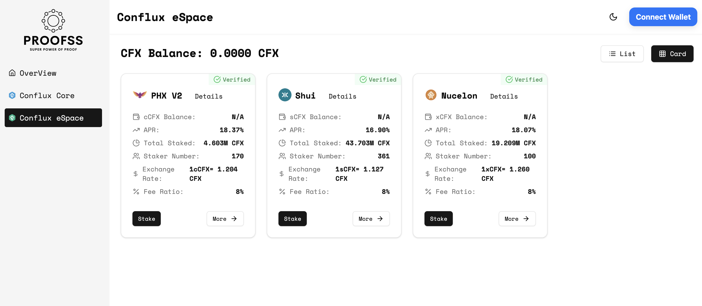

# PoSHub

[Proofss PoSHub](https://hub.proofss.com/) is an aggregated platform for PoS staking pools and LSD protocols, enabling users to easily participate in PoS staking across multiple networks through a single interface. It allows for unified management of assets and rewards across various PoS protocols.

## Supported Networks

Currently, PoS Hub supports the following networks:

- Ethereum  
- Conflux eSpace  
- Conflux Core Space  

In the future, we plan to support more networks such as BNB Chain, Cardano, Solana, Polkadot, and others.

## How It Works

When users interact with the apps of various mining pools or LSD protocols, they are essentially interacting with the smart contracts deployed on the blockchain by these platforms. Since blockchain is an open platform, anyone can directly interact with smart contracts. Our aggregated UI integrates with the smart contracts of various mining pools and LSD protocols, allowing us to retrieve the user's staked assets and earnings across these platforms. Furthermore, it enables users to interact directly (e.g., staking, redeeming, claiming rewards, etc.).

The Validator nodes and smart contracts of each PoS mining pool are maintained and operated by the **respective mining pools or LSD protocols**.

Assets staked by users in various protocols can be viewed directly on PoSHub, and vice versa. Assets staked via PoSHub can also be viewed and managed within the respective protocols.

## Security

PoSHub will integrate with the leading PoS mining pools and LSD services across various networks. We have a fixed set of integration standards (e.g., staking volume, contract verification, operational history, etc.), and only mining pools and protocols that meet these standards will be integrated. We will periodically evaluate the integrated pools and protocols, and projects that fail to meet the standards will be removed.

PoSHub **does not make any guarantees** regarding the security of the integrated pools and protocols, nor does it recommend any specific mining pools. **Users are responsible** for independently assessing the security of each pool and protocol when using PoSHub for staking.

PoSHub is essentially an aggregated UI, and we ensure the security of the UI itself. Users' staked assets and rewards are stored in the smart contracts of the respective pools and protocols. PoSHub does not have access to or control over users' assets.

## FAQs

### How can mining pools and LSD protocols apply for integration?

Please contact the Proofss team via email at proofsslab@proton.me. We will evaluate the mining pools and protocols applying for integration, and projects that meet the standards will be integrated.

### Why can't I withdraw my staked assets?

Almost every PoS network has a lock-up period during which users cannot withdraw their staked assets. The length of the lock-up period is determined by each network and protocol. Please refer to the documentation of the protocol you are using.
